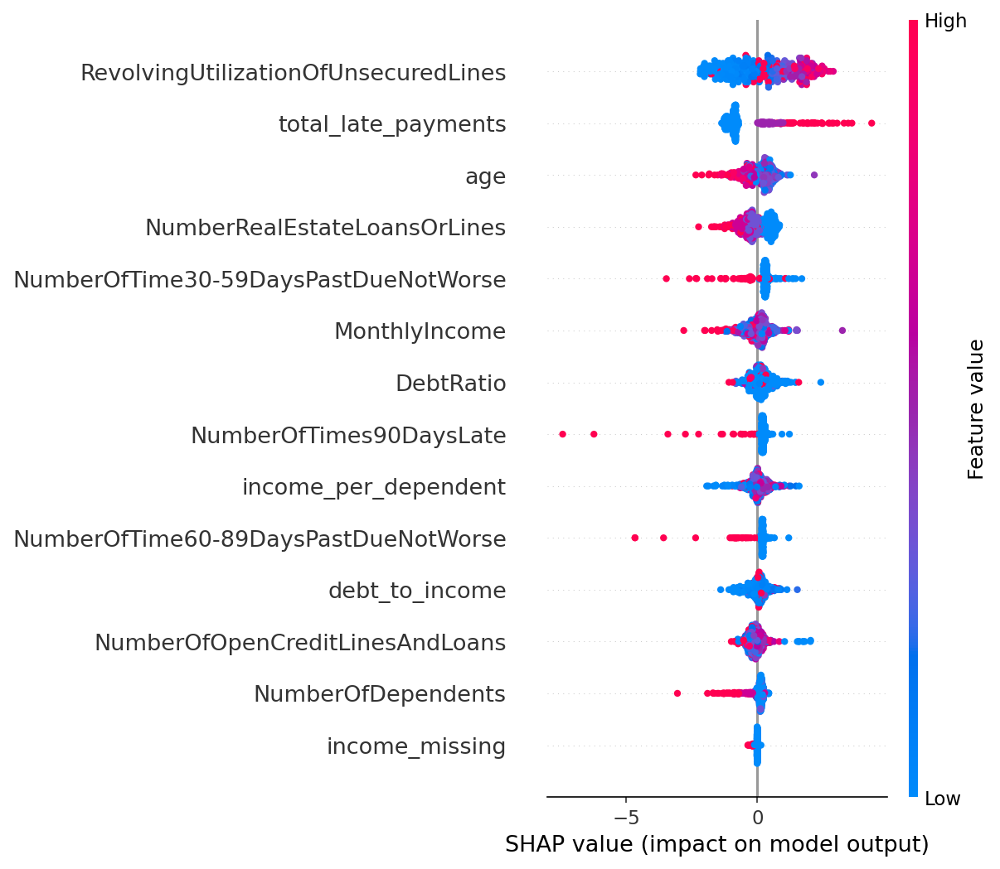
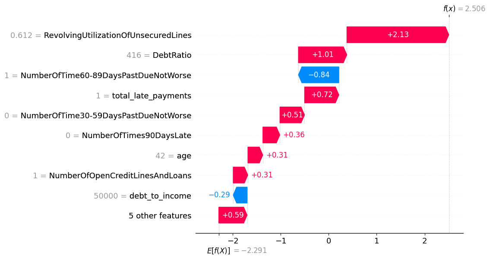
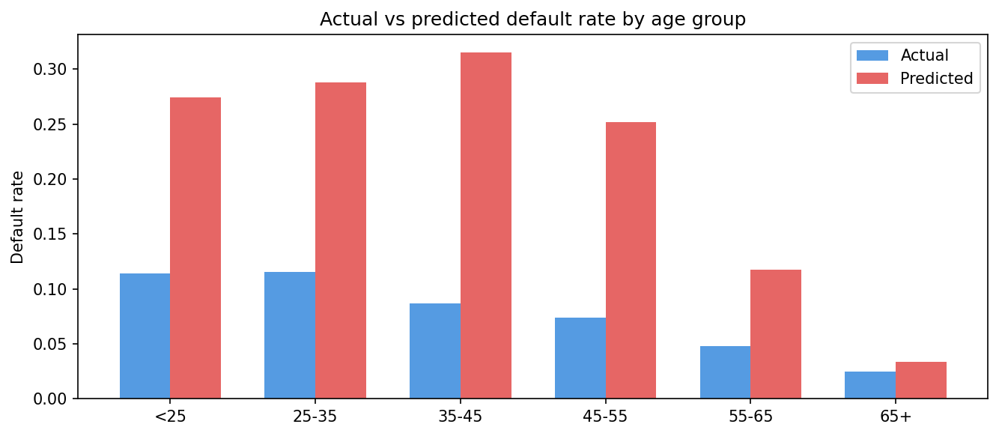
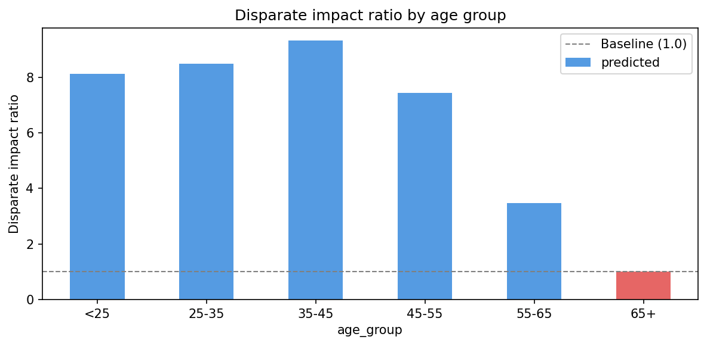

# Credit Risk Scoring Model

A machine learning project that predicts the probability of a borrower defaulting 
on a loan. Built with LightGBM, SMOTE for class imbalance, SHAP explainability, 
and a fairness audit across age groups.

## Live demo
🔗 [credit-risk-scorer.streamlit.app](https://credit-risk-scorer-g8ve5yfappj3mvcyelhvxhz.streamlit.app/)

Enter a borrower's financial details and get an instant default probability with 
a feature-level SHAP explanation of why that score was given.

---

## Problem statement
Banks and lenders need to assess whether a borrower will repay a loan. This project 
builds an ML model on 150,000 real loan records that outputs a default probability 
for any borrower profile — along with an explanation of which factors drove that score.

---

## Tech stack
- **Model:** LightGBM
- **Imbalance handling:** SMOTE (imbalanced-learn)
- **Explainability:** SHAP
- **Hyperparameter tuning:** Optuna
- **Deployment:** Streamlit Cloud
- **Language:** Python (pandas, scikit-learn, matplotlib, seaborn)

---

## Dataset
[Give Me Some Credit](https://www.kaggle.com/c/GiveMeSomeCredit) — Kaggle  
150,000 borrower records with 10 financial features and a binary default label.  
Class imbalance: ~93% non-default, ~7% default.

---

## Results

| Metric | Score |
|---|---|
| AUC-ROC — Logistic Regression baseline | 0.8474 |
| AUC-ROC — LightGBM (before tuning) | 0.7603 |
| AUC-ROC — LightGBM (after Optuna tuning) | 0.7879 |
| KS Statistic | 0.4459 |
| Accuracy | 82% |
| Recall — Default class | 61% |
| Precision — Default class | 21% |

> KS Statistic of 0.4459 is well above the industry benchmark of 0.30 — indicating 
> strong separation between defaulters and non-defaulters.

---

## Project steps

### 1. Exploratory data analysis
- Identified 7% class imbalance (~2,002 defaulters out of 29,878 in test set)
- Found missing values in MonthlyIncome (29%) and NumberOfDependents (2.6%)
- Detected outliers: age = 0, revolving utilization > 1.0, sentinel values (96/98) 
  in late payment columns
- Analysed default rate by age group — under-25s default at 11.44%, vs 2.45% for 65+

### 2. Preprocessing
- Removed impossible ages (age = 0)
- Capped revolving utilization at 1.0
- Capped late payment columns at 10 (removed sentinel values)
- Created `income_missing` flag before imputing MonthlyIncome with median
- Engineered 3 new features: `debt_to_income`, `total_late_payments`, 
  `income_per_dependent`
- Applied SMOTE to training data only (after train/test split)

### 3. Modelling
- Baseline: Logistic Regression (AUC 0.8474)
- Main model: LightGBM with early stopping (AUC 0.7603)
- Hyperparameter tuning: Optuna — 30 trials (AUC 0.7879)
- Evaluation: AUC-ROC, precision-recall, confusion matrix, KS statistic

### 4. Explainability (SHAP)


The summary plot shows that revolving utilization and total late payments are the 
strongest predictors of default. High utilization consistently pushes risk up, while 
zero late payments strongly reduces predicted risk.



The waterfall plot explains an individual prediction — showing exactly which features 
pushed a specific borrower's risk score up or down from the base rate.

### 5. Fairness audit

Default rate, predicted rate, and average risk score were analysed across 6 age groups.





| Age group | Actual default % | Predicted flag % | Avg risk score | Count |
|---|---|---|---|---|
| <25 | 11.44% | 27.46% | 0.2503 | 568 |
| 25–35 | 11.53% | 28.76% | 0.2698 | 3,512 |
| 35–45 | 8.66% | 31.54% | 0.2856 | 5,993 |
| 45–55 | 7.42% | 25.20% | 0.2452 | 7,451 |
| 55–65 | 4.81% | 11.74% | 0.1594 | 6,677 |
| 65+ | 2.45% | 3.38% | 0.0738 | 5,675 |

**Key findings:**
- Default rate drops consistently with age — from 11.44% for under-25s to 2.45% 
  for 65+, reflecting genuine differences in financial history length
- The model's predicted flag rate is higher than the actual default rate across all 
  groups — expected behaviour given SMOTE training
- Model performance remains consistent across age groups (KS: 0.4459 overall), 
  suggesting the disparity reflects real risk differences rather than model bias

---

## How to run locally

```bash
git clone https://github.com/AviralSaxena7/credit-risk-scorer
cd credit-risk-scorer
pip install -r requirements.txt
streamlit run app.py
```

---

## Resume bullet points
- Built a credit default prediction model (LightGBM, AUC 0.79, KS 0.45) on 150k 
  records with SMOTE for class imbalance and Optuna hyperparameter tuning
- Added SHAP-based explainability and a fairness audit across 6 age groups using 
  disparate impact ratio — deployed as a live Streamlit app
- Engineered 3 domain-specific features (debt-to-income ratio, total late payments, 
  income per dependent) informed by credit industry knowledge

---

## Author
Made by Aviral Saxena — [LinkedIn](https://www.linkedin.com/in/aviral-saxena-829ba6276/)
